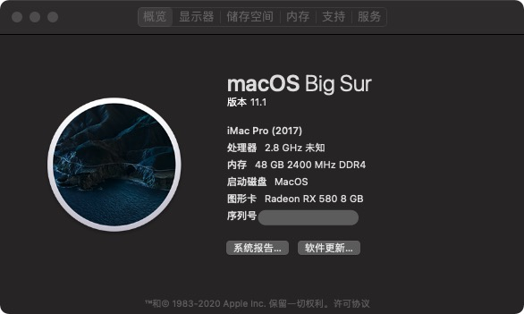
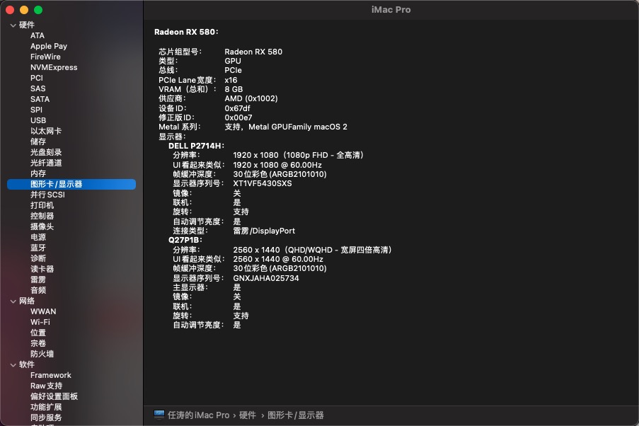
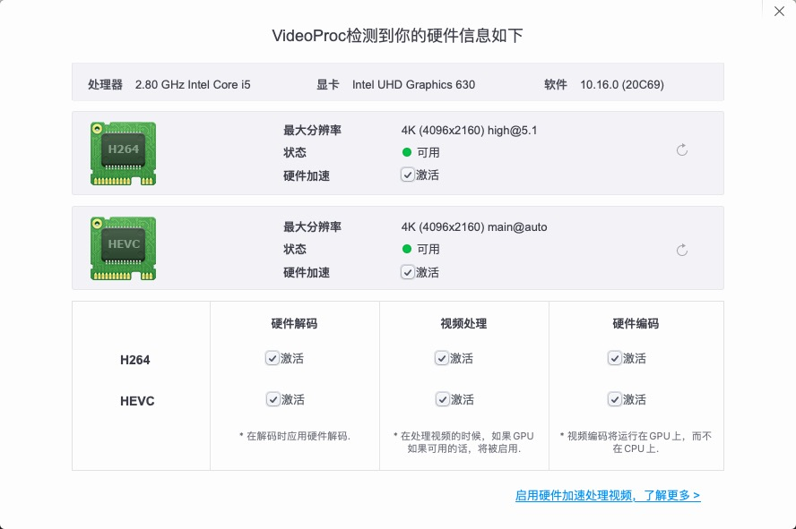

# MSI(微星) z370m mortar i5-8400 RX580 OPENCORE

##  关于这台黑苹果 

### 网卡正常，隔空投送，硬件加速正常

- mortherbroad : MSI Mortar Z370M
- CPU: intel i5 8400
- Disk : HP 惠普 EX900 M.2 NVMe 固态硬盘 500GB
- Graphics: Intel UHD Graphics 630 & RX580
- SIMBOS :  iMacPro19,1

If" config.plist" not work,try use "config_back.plist".
如果" config.plist" 不能正常启动，可以尝试"config_back.plist".

Only for macOS 11.x , if you want 10.15 or later , change it by yourself。
只兼容 11.1 ，如果你打算用来装10.15或之前的，自己增删改查一下。

